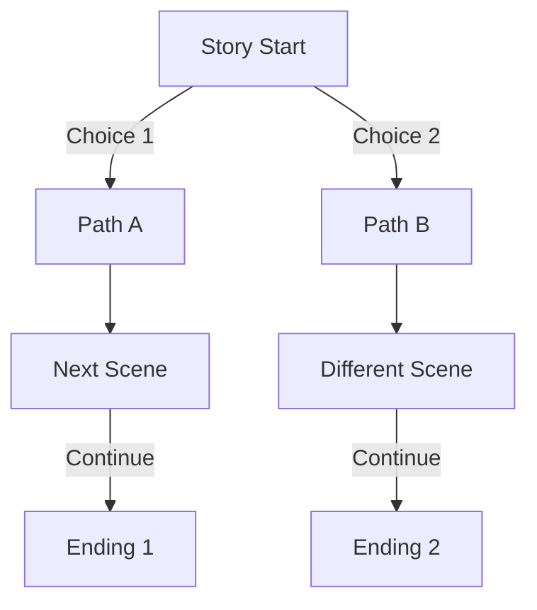
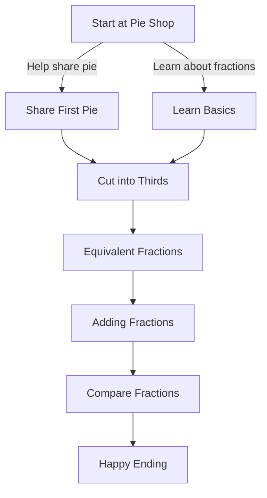
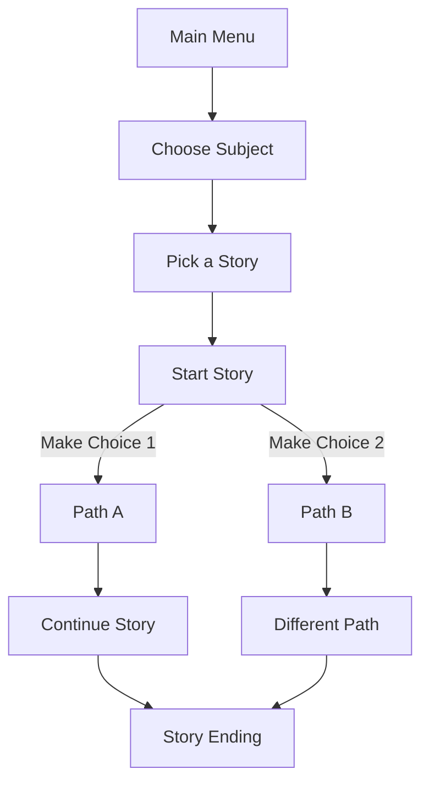

# 📚 My Interactive Story Adventure App

Hi! I'm a 6th-grade student, and I created this app to make learning more fun! Here's how it works:

## 🎯 What Does The App Do?

This app lets you read and interact with educational stories. Instead of just reading straight through, you get to make choices that change how the story goes! It's like being the main character in your own adventure while learning about:

- 🔢 Math (Fractions, Integers, Numbers)
- 📝 English
- 🧪 Science
- 🌍 Social Studies

## 🗺️ How Stories Work

Each story is like a tree with many branches. Here's a simple flow diagram:

### 📖 Example Story Flow

Here's how "The Fraction Friends' Big Feast" works:

## 🎮 How to Use the App

1. **Pick a Subject**: Choose from different subjects like Math, English, Science
2. **Choose a Story**: Each subject has different stories
3. **Make Choices**: Read the story and click on choices
4. **Learn & Have Fun**: Each path teaches you something new!

## 📱 Features

### Subject Categories
- 🔢 **Math Stories**
  - The Kingdom of Numbers (about factors and multiples)
  - The Fraction Friends' Big Feast (about fractions)
  - The Kingdom of Integers (about positive and negative numbers)

- 📚 **English Stories**
  - The Enchanted Forest
  - Dragon Quest
  - Wizard's Tower

- 🧪 **Science Stories**
  - The Curious Magnet
  - The Magic of Separation
  - Green Friends and Wild Ones

### Story Structure

Here's how each story is organized:

## 🌟 What Makes It Special

1. **Interactive Learning**: You learn by making choices and seeing what happens
2. **Fun Stories**: Each story is fun and teaches something important
3. **Cool Emojis**: Stories have emojis to make them more fun! 😊
4. **Multiple Endings**: Your choices can lead to different endings
5. **Educational Content**: Every story teaches real school subjects

## 💡 How I Built It

The app uses:
- JavaScript for the stories
- A special format to organize the choices
- Emojis to make it fun
- Clear organization by subject

## 👩‍🏫 For Teachers

This app helps students learn because:
1. It makes learning interactive and fun
2. Students can see the results of their choices
3. Stories combine entertainment with education
4. Each path reinforces learning concepts
5. Students stay engaged through decision-making

## 🎉 Future Ideas

I want to add:
- More stories for each subject
- Sound effects
- Animations
- More subjects
- Achievements for completing stories

---
Made with ❤️ by Team Howling Hounds
