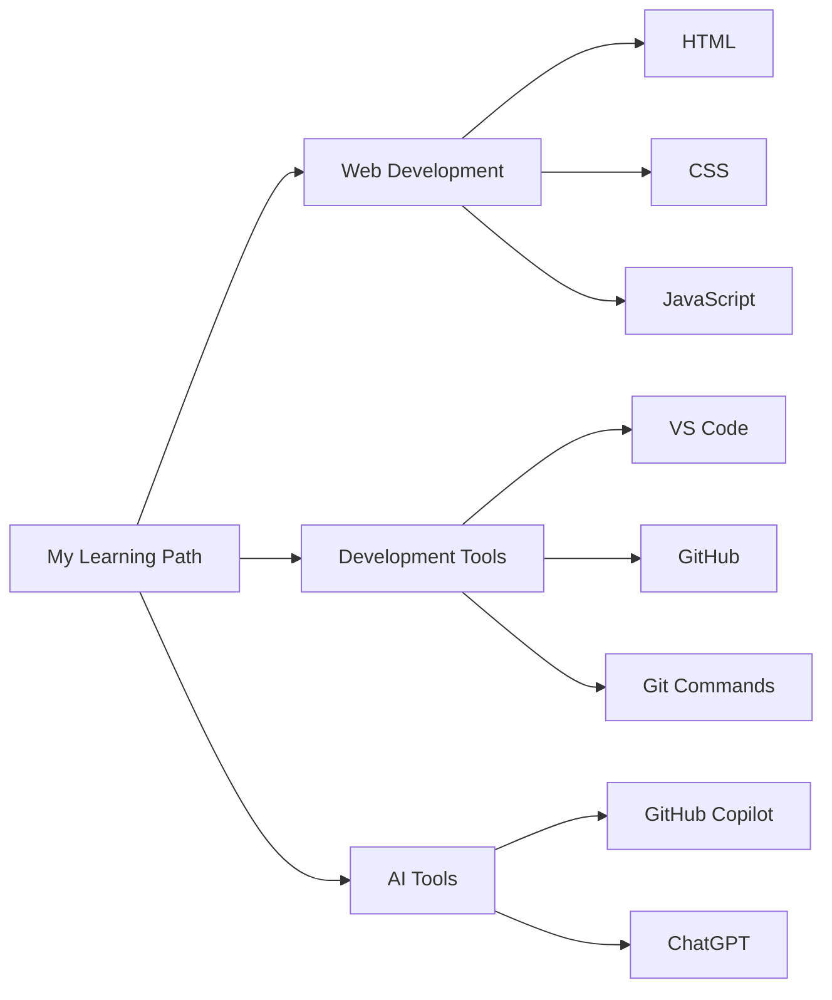
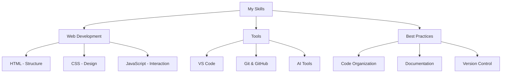

# 📚 My Interactive Story Adventure App

Hi! I'm a 6th-grade student, and I created this app to make learning more fun! Here's how it works:

## 🎯 What Does The App Do?

This app lets you read and interact with educational stories. Instead of just reading straight through, you get to make choices that change how the story goes! It's like being the main character in your own adventure while learning about:

- 🔢 Math (Fractions, Integers, Numbers)
- 📝 English
- 🧪 Science
- 🌍 Social Studies

## 🗺️ How Stories Work

Each story is like a tree with many branches. Here's a simple flow diagram:

### 📖 Example Story Flow

Here's how "The Fraction Friends' Big Feast" works:

## 🎮 How to Use the App

1. **Pick a Subject**: Choose from different subjects like Math, English, Science
2. **Choose a Story**: Each subject has different stories
3. **Make Choices**: Read the story and click on choices
4. **Learn & Have Fun**: Each path teaches you something new!

## 📱 Features

### Subject Categories
- 🔢 **Math Stories**
  - The Kingdom of Numbers (about factors and multiples)
  - The Fraction Friends' Big Feast (about fractions)
  - The Kingdom of Integers (about positive and negative numbers)

- 📚 **English Stories**
  - The Enchanted Forest
  - Dragon Quest
  - Wizard's Tower

- 🧪 **Science Stories**
  - The Curious Magnet
  - The Magic of Separation
  - Green Friends and Wild Ones

### Story Structure

Here's how each story is organized:

## 🌟 What Makes It Special

1. **Interactive Learning**: You learn by making choices and seeing what happens
2. **Fun Stories**: Each story is fun and teaches something important
3. **Cool Emojis**: Stories have emojis to make them more fun! 😊
4. **Multiple Endings**: Your choices can lead to different endings
5. **Educational Content**: Every story teaches real school subjects

## 💡 How We Built It

### 🔧 Technologies We Learned

As a 6th grader, I learned many exciting technologies to build this app:

1. **Web Development Basics**:
   - HTML: To structure the web pages
   - CSS: To make everything look nice and colorful
   - JavaScript: To make the stories interactive

2. **Development Tools**:
   - VS Code: A cool editor that helped me write code
   - GitHub: To save my work and share it with others
   - Git Commands: Like `git add`, `git commit`, and `git push`
   - Command Prompt: To run special commands on my computer

3. **AI Assistance**:
   - GitHub Copilot: Helped me write code faster
   - ChatGPT: Helped me learn and solve problems

### 🛠️ App Structure
- JavaScript for the stories
- A special format to organize the choices
- Emojis to make it fun
- Clear organization by subject

## 👩‍🏫 For Teachers

This app helps students learn because:
1. It makes learning interactive and fun
2. Students can see the results of their choices
3. Stories combine entertainment with education
4. Each path reinforces learning concepts
5. Students stay engaged through decision-making

## 🎉 Future Ideas

I want to add:
- More stories for each subject
- Sound effects
- Animations
- More subjects
- Achievements for completing stories

## 👨‍💻 What I Learned as a Young Developer

Building this app taught me so many cool things:

### 💻 Technical Skills

### 🌟 Key Learnings
1. **Problem Solving**:
   - Breaking big problems into smaller parts
   - Finding solutions through research
   - Using AI tools wisely

2. **Project Management**:
   - Organizing my code files
   - Keeping track of changes with Git
   - Writing clear documentation

3. **Coding Best Practices**:
   - Writing clean, organized code
   - Adding helpful comments
   - Using version control

4. **Using Modern Tools**:
   - VS Code features and extensions
   - Git commands for version control
   - AI tools for learning and coding help

---
Made with ❤️ by Team Howling Hounds
